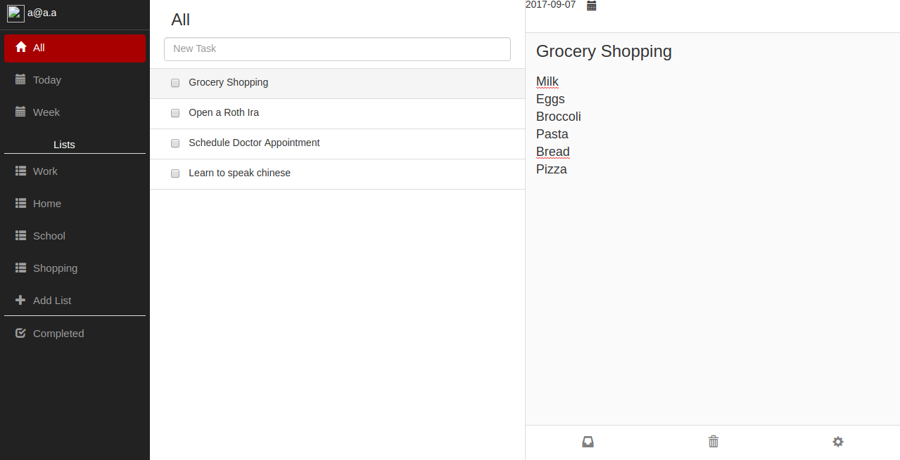

Todoapp build with ASP NET CORE + Angular2

Uses

* [JavaScriptServices](https://github.com/aspnet/JavaScriptServices)
* [My Date Picker](https://github.com/kekeh/mydatepicker)

#### Run

Working Dockerfile!

Build with

`docker build . -t todoapp`

Run with

`docker run -p 5000:5000 todoapp`